## Interior Website project 
<p align="reft">
  
</p>

---
## R&D Team

<table align="center" width="100%">
  <tr>
    <!-- 김장유 -->
    <td align="center" width="25%">
      <br/>
      <b>김장유</b><br/>
      Team Leader
      <div style="font-size:12px; margin-top:6px;">
        <div>• 프로젝트 총괄 </div>
        <div>• DB/통합 구조 설계</div>
        <div>• UI·UX/문서 정리</div>
      </div>
      <div style="margin-top:20px;">
        <a href="https://github.com/jangy00" target="_blank">
          
        </a>
      </div>
    </td>
    <!-- 송정민 -->
    <td align="center" width="25%">
      <br/>
      <b>송정민</b><br/>
      Full-Stack
      <div style="font-size:12px; margin-top:6px;">
        <div>• 데이터 로직 구현</div>
        <div>• 제품 페이지 개발</div>
        <div>• 카테고리 로직 구현</div>
      </div>
      <div style="margin-top:20px;">
        <a href="https://github.com/SJM-source" target="_blank">
          
        </a>
      </div>
    </td>
    <!-- 이혜지 -->
    <td align="center" width="25%">
      <br/>
      <b>이혜지</b><br/>
      Full-Stack
      <div style="font-size:12px; margin-top:6px;">
        <div>• 상세 페이지 구현</div>
        <div>• 로그인·회원가입 구현 </div>
        <div>• 폼 구조 / 유효성 검증</div>
      </div>
      <div style="margin-top:20px;">
        <a href="https://github.com/lhj8-8" target="_blank">
          
        </a>
      </div>
    </td>
    <!-- 전성희 -->
    <td align="center" width="25%">
      <br/>
      <b>전성희</b><br/>
      Front-end
      <div style="font-size:12px; margin-top:6px;">
        <div>• 메인 인터페이스 UI </div>
        <div>• 메뉴 슬라이더 제작</div>
        <div>• 프론트 비주얼 세팅</div>
      </div>
      <div style="margin-top:20px;">
        <a href="https://github.com/sunghee3682899-commits" target="_blank">
          
        </a>
      </div>
    </td>
  </tr>
</table>

---

## Contents
- [개요 (Overview)](#overview)
- [기술 스택 (Tech Stack)](#tech-stack)
- [설치 및 실행 (Installation--run)](#installation--run)
- [유스케이스 다이어그램 (Use Case Diagram)](#use-case-diagram)
- [ERD 다이어그램 (ERD Diagram)](#erd-diagram)
- [PPT 포트폴리오 (Portfolio)](#portfolio)
- [업데이트 로그 (Updatelog)](#updatelog)

---

## <a id="overview"></a>Overview
**GAGU**는 Flask 프레임워크 기반의 AI를 활용한 혁신적인 인테리어 쇼핑 웹사이트로 <br>
사용자가 원하는 공간에 가구 배치 및 추천 제안을 받아 누구나 오프라인에서도 만족할 수 있게 설계된 
지능형 쇼핑 웹사이트입니다.

> 🎯 **목표:** AI 산업에 맞춘 웹사이트 확장  

---

## Tech Stack

### Front-end


### Back-end 


### Database


### Tooling


---

## <a id="installation--run"></a>Installation

### ① 프로젝트 클론
```js

git clone https://github.com/Sprout2025/interior-project
cd interior-project

python -m venv venv
venv\Scripts\activate

pip install -r requirements.txt

flask run

```
---
## <a id="use-case-diagram"></a> Use Case Diagram
<details> <summary><b>Usecase Diagram</b></summary> <p align="center"> 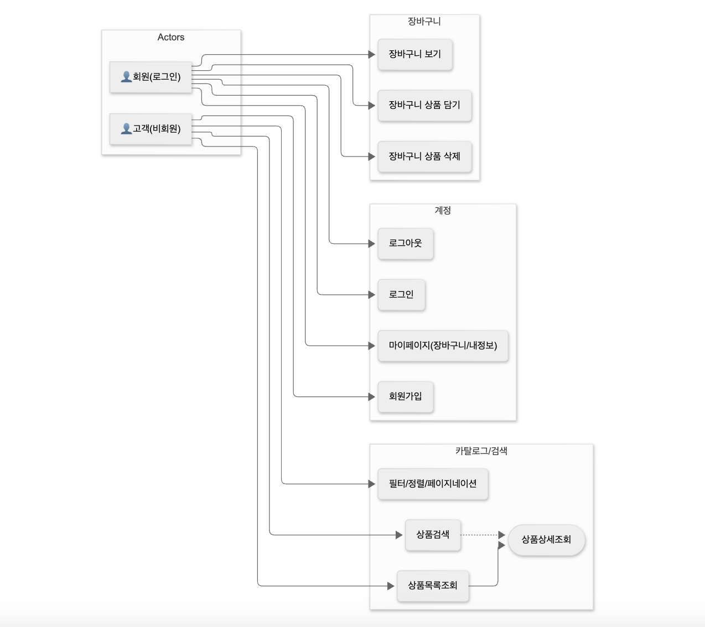 </p> </details>

---
## <a id="erd-diagram"></a> ERD 
<details> <summary><b>ERD Diagram</b></summary> <p align="center"> 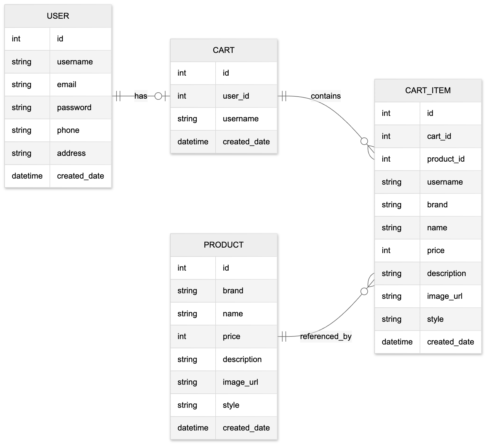 </p> </details>  

---
## PPT

<details><summary><b> PPT </b></summary>
  
|   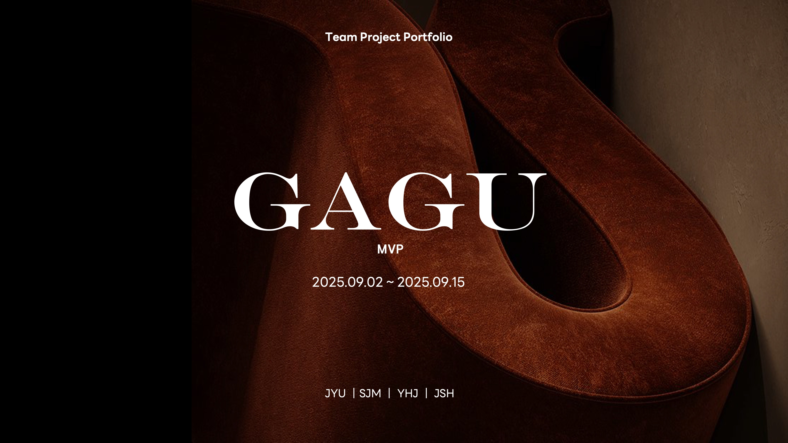   | 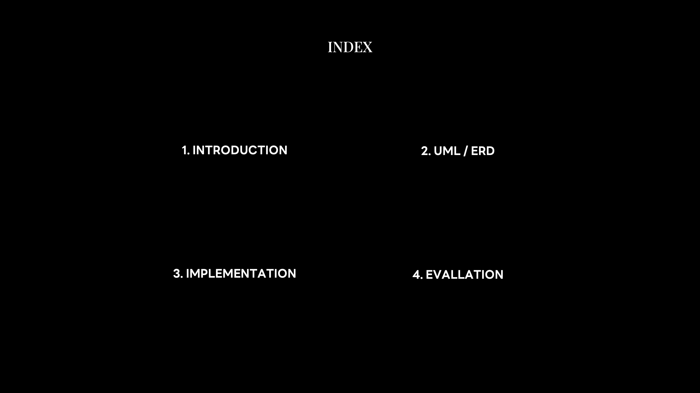 |
|:-----------------------------------------:| :--: |
| 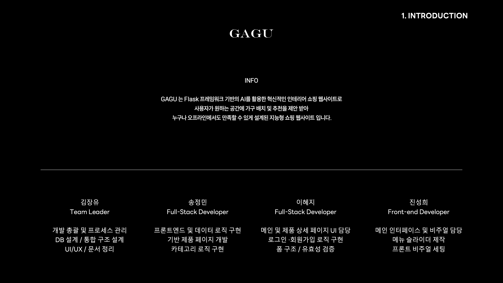  | 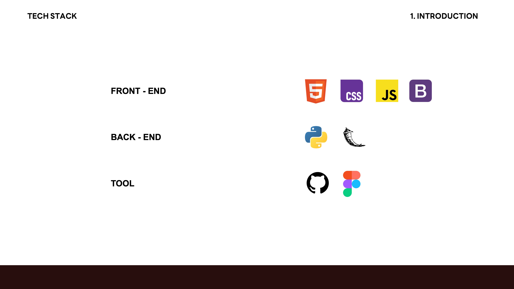 |
| 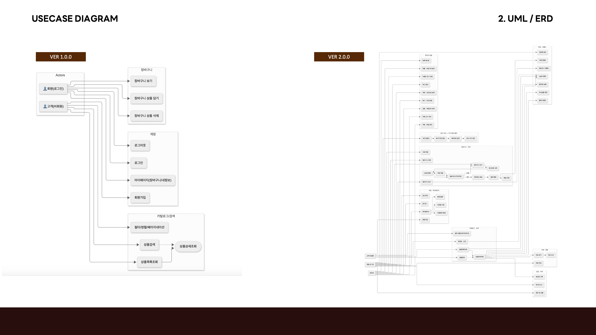  | 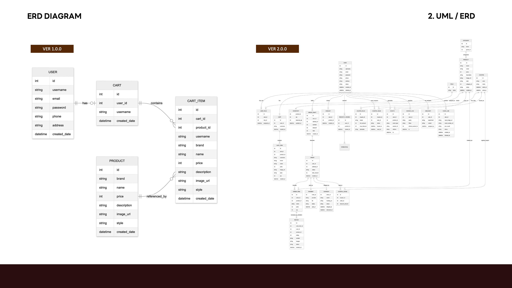 |
|   | 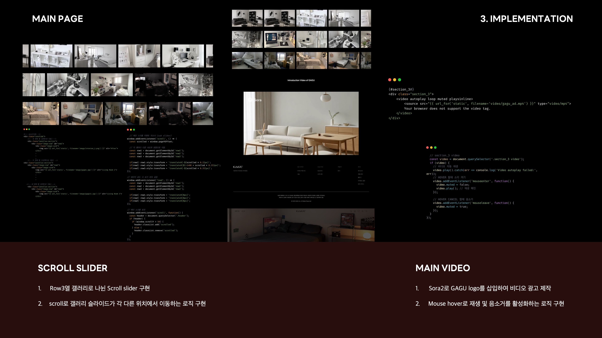 |
| 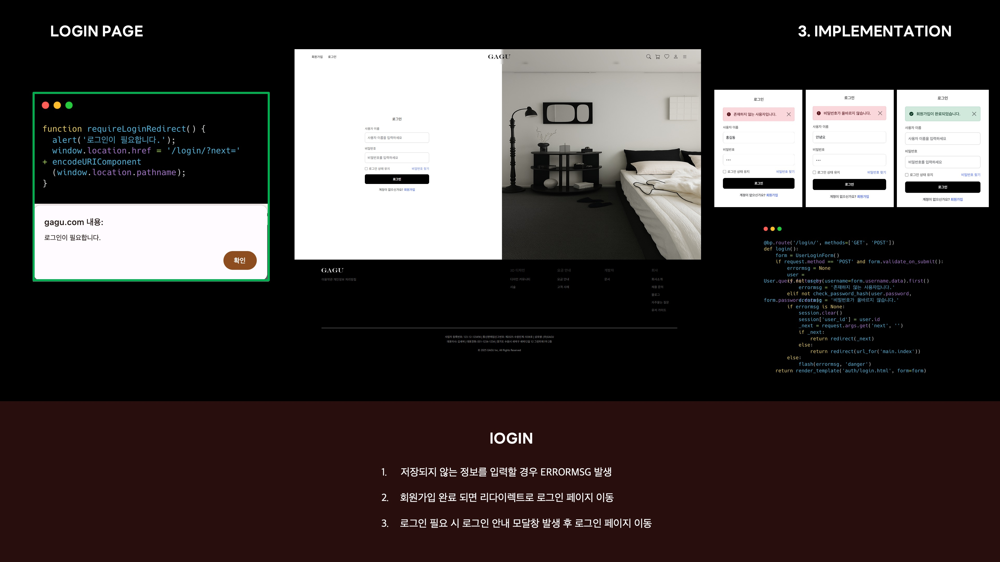  | 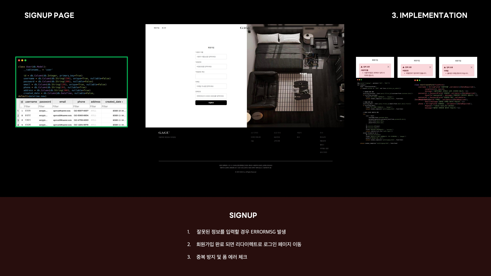 |
| 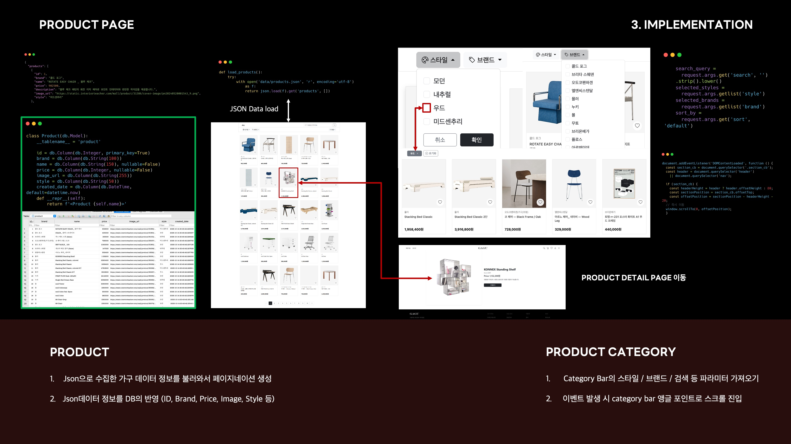 |  |
| 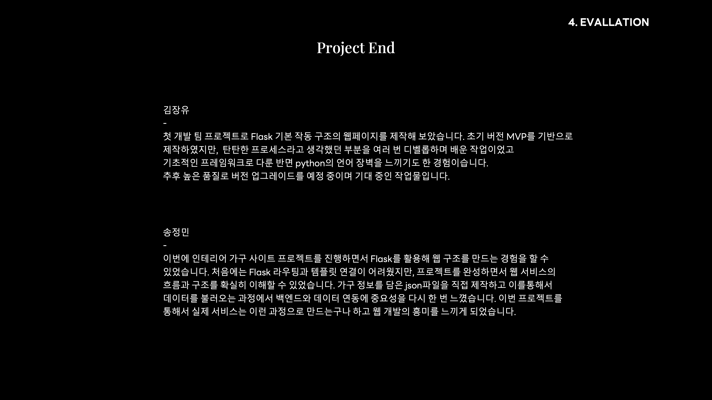 | 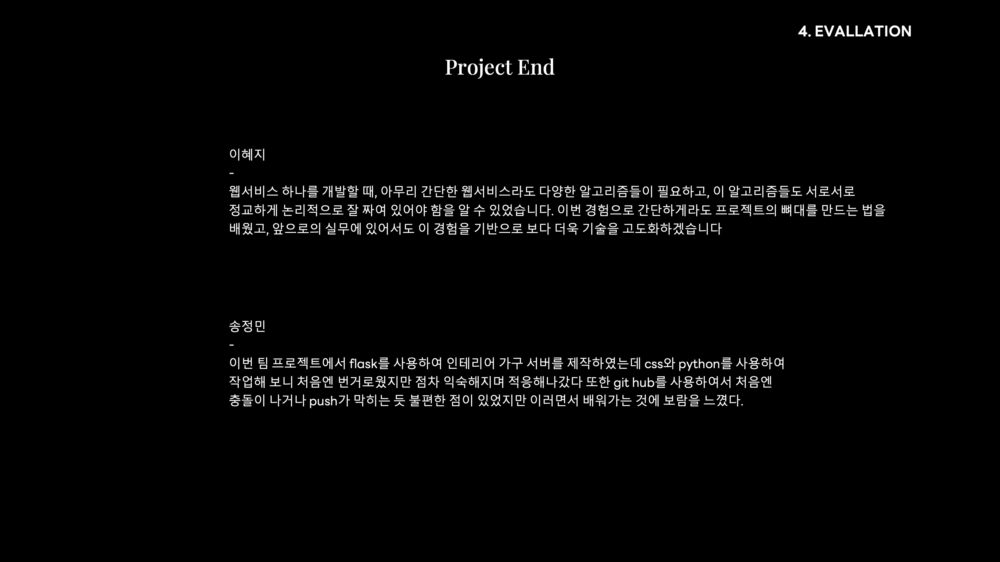 |
|  |  |

</details>
<a id="portfolio"></a>

---
## <a id="updatelog"></a>업데이트 로그
| 버전         | 변경 사항                | 날짜      |
|------------|----------------------|---------|
| **v1.0.0** | 기본 웹사이트 필수 구조 설계     | 2025-10 |
| **v1.1.0** | -                    | -       |
| **v1.2.0** | -                    | -       |


